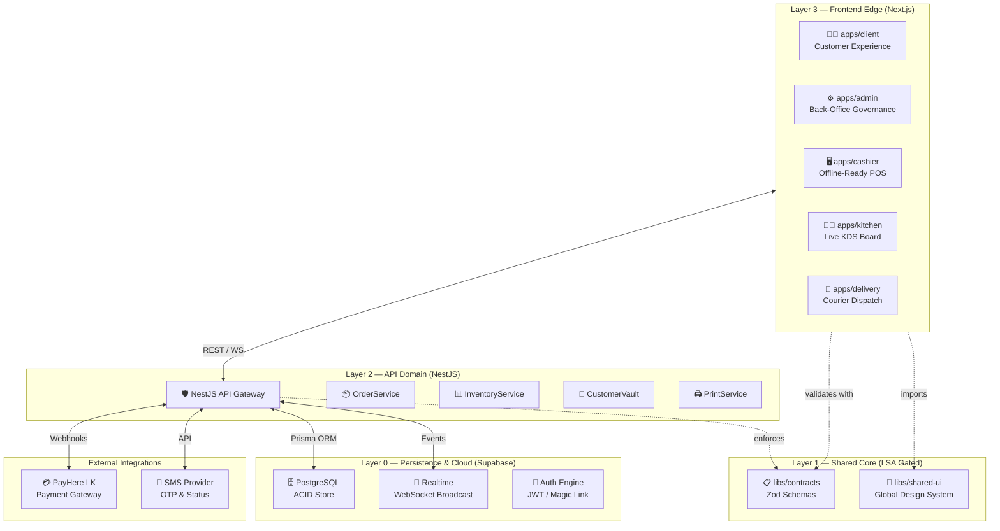
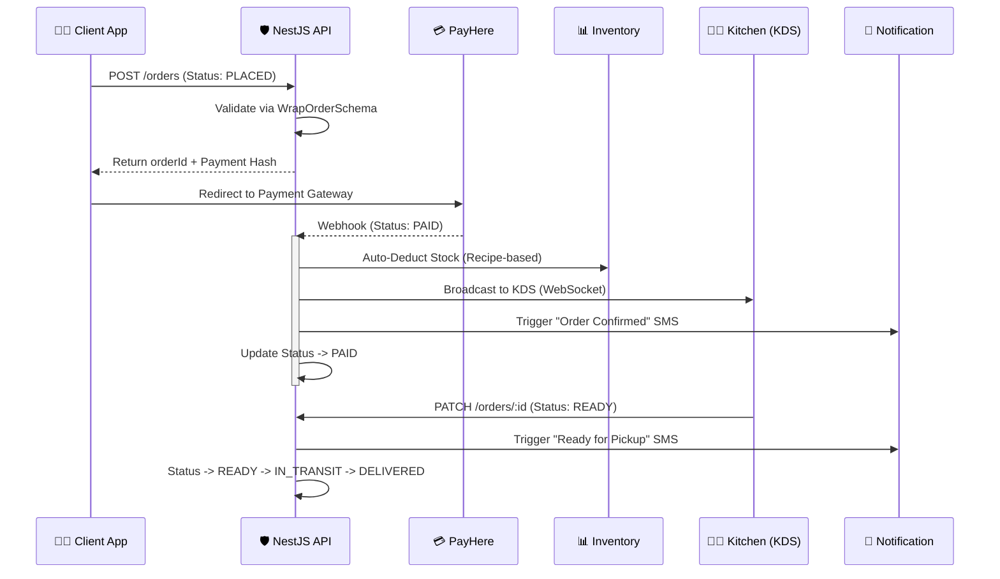
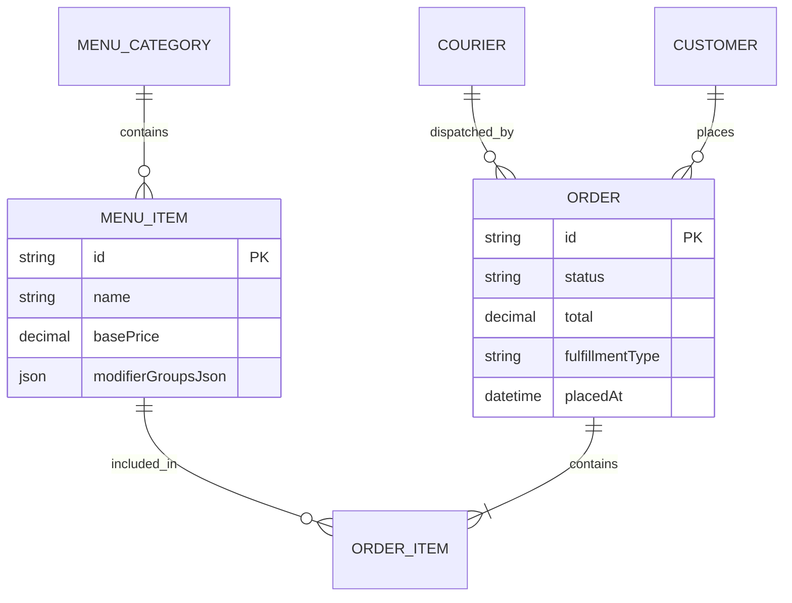
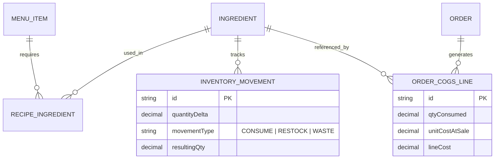
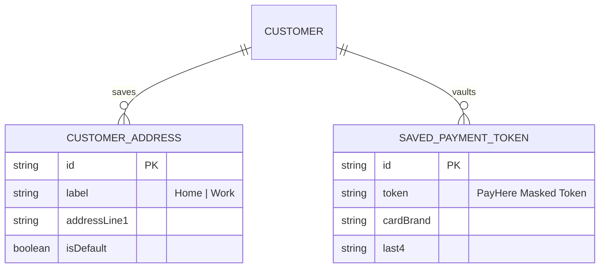

# 🏛️ ARCHITECTURE.md — Wrap & Roll Restaurant Ecosystem

> **Document Status**: `v2.1` | **Model**: Professional Governance | **Last Updated**: 2026-04-12
> **Operational Link**: For role-specific workflows, see [OPERATIONS.md](./OPERATIONS.md)

---

## 1. System Topography

**Wrap & Roll** is a high-concurrency, multi-interface restaurant management ecosystem. The architecture is built on a **4-Layer Monorepo** strategy ensuring strict Separation of Concerns (SoC) and a single source of truth for all business contracts.

For a detailed breakdown of how each role (Admin, Cashier, Kitchen, Courier, Customer) interacts with these layers, refer to the [OPERATIONS.md](./OPERATIONS.md) guide.

---

## 2. Order Lifecycle & State Machine

The order flows through a hardened state machine. Transitions are restricted and trigger side-effects (Print, Inventory, Notifications) via an Event-Driven architecture.

---

## 3. Data Schema (ERDs)

### 3.1 Operations & Discovery
The core relationship between Menu items, Orders, and the fulfillment lifecycle. In ERDs below, the **CUSTOMER** entity is the persisted customer profile (Prisma `Customer`), which is separate from the Supabase auth role **`CLIENT`** for storefront users.

### 3.2 Inventory & COGS (Cost of Goods Sold)
Advanced tracking for ingredient-level stock control and profit margin analysis.

### 3.3 Customer Identity & Vault
Secure storage for user profiles, saved delivery addresses, and payment tokens.

---

## 4. Design System — `libs/shared-ui`

We enforce a **Sovereign Design System** built on HSL variables and Atomic Primitives to eliminate duplication across the 5 apps.

### Core Tokens (`tokens.css`)
- **Primary**: `var(--primary)` (Mandarin / Coral)
- **Secondary**: `var(--secondary)` (Deep Onyx)
- **Glassmorphism**: `var(--ui-blur)`, `var(--ui-glow)`
- **Interaction**: `var(--transition-smooth)` (cubic-bezier)

### Master Primitives
1.  **`AppShell`**: Universal responsive layout container.
2.  **`SharedDataGrid`**: High-performance data table for Admin/Cashier.
3.  **`Navbar` / `Footer`**: Standardized identity bars with localization support.
4.  **`StatusPill`**: Animated status indicators.
5.  **`GlassCard`**: Consistent elevation and blur primitives.
6.  **`WrapBuilder` (Logic-Lite)**: Interactive selection components for the menu.

---

## 5. Security & Governance

- **RBAC**: Handled via Supabase JWT metadata. Staff roles: `ADMIN`, `CASHIER`, `KITCHEN`, `COURIER`. Storefront shoppers: `CLIENT` (see `SHOPPER_ROLE` in `@wrap-roll/contracts`).
- **IDOR Protection**: `OrderController` enforces that a user with the `CLIENT` role can only view their own `customerId` or anonymous session orders.
- **Webhook Hardening**: `PaymentService` signature verification + idempotency tokenization.
- **Audit Logging**: `StaffAuditLog` captures all critical mutations (Price changes, Refunds, HR updates).

---

## 6. Development Workflow (NX)

### Project Commands
- **Run All**: `npx nx run-many --target=dev --projects=api,client,admin`
- **Build All**: `npx nx run-many --target=build --all`
- **Test Core**: `npx nx test api` (Contract & Lifecycle tests)
- **Database (dev/test)**: soft vs hard reset, seed, and Prisma hybrid workflow — [docs/ops/database-reset.md](../docs/ops/database-reset.md)

---

> **LSA Note**: This architecture is LOCKED. Structural deviations require a formal RFC.
