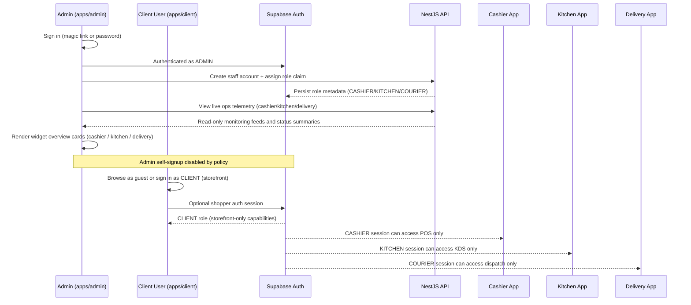
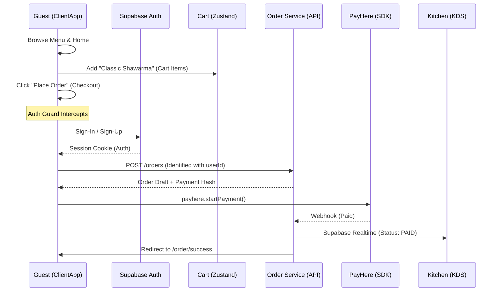
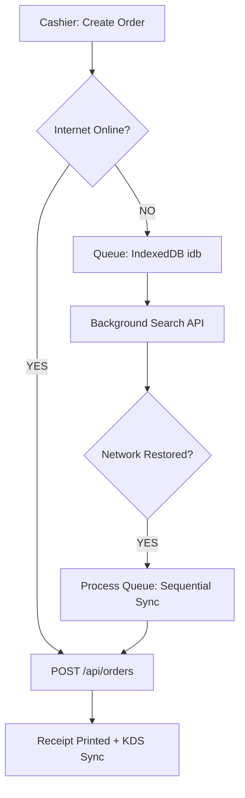
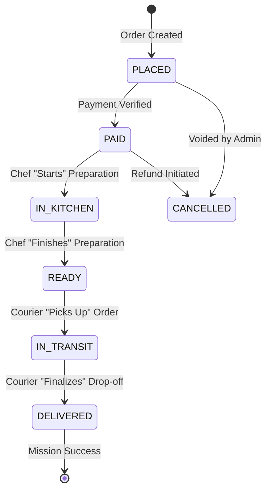

# 🗺️ FLOW_BOARD.md — Logical Architecture & Lifecycles

This document visualizes the complex, identity-guarded lifecycles and data flows across the **Wrap & Roll** monorepo.

---

## 👥 RBAC Provisioning & Access Flow

This flow documents the locked staffing model: one admin account provisions and governs operational roles.

---

## 🔐 Identity-Guarded Order Lifecycle (Mandatory Conversion)

This flow documents the **Customer Journey (S5/S6)** where users must sign in before converting a guest cart into a paid order.

---

## 📟 POS Transaction Lifecycle (Offline Resilience)

This flow documents the **Offline Sync (S3)** logic for the Cashier POS.

---

## 🍔 Fulfillment Lifecycle (Operational State)

The state transition logic across Kitchen and Delivery.

**I have authorized this flow board for 2026 production deployment. 🌯🏢🏛️**
