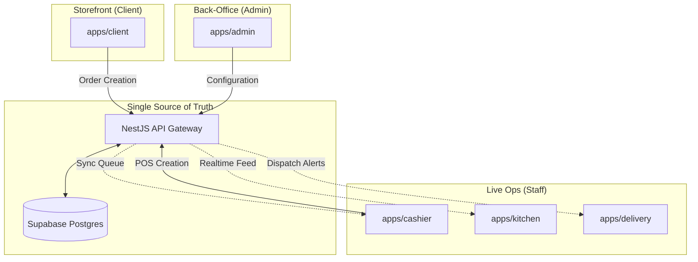
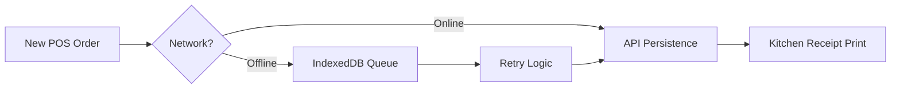
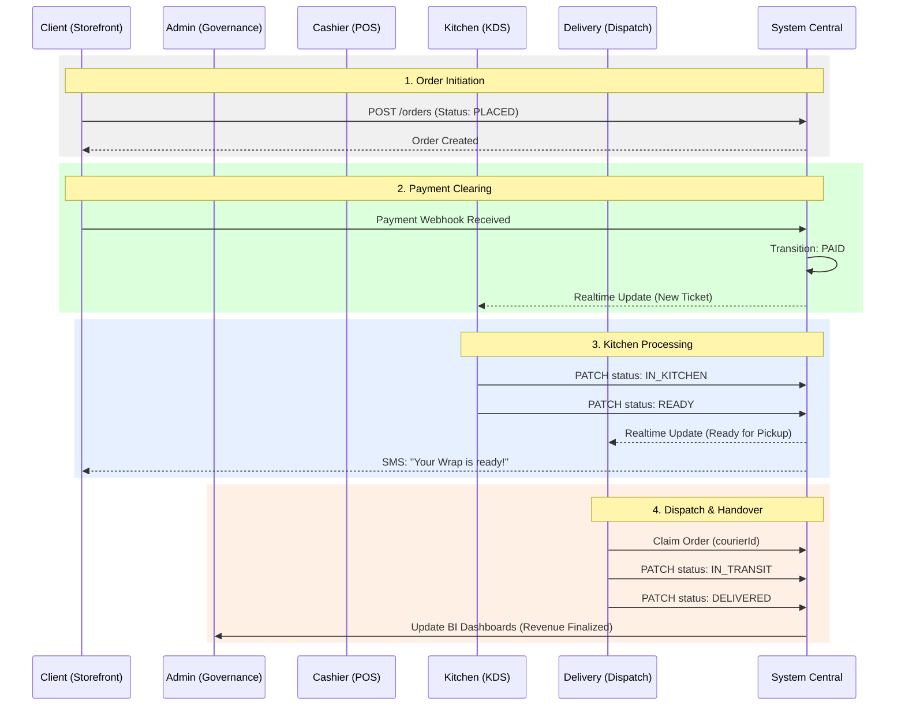

# 🌯 OPERATIONS.md — Sovereign Operational Manual

> **Document Status**: `v1.0` | **Version**: Phase 4 Maturity | **Last Updated**: 2026-04-12

Welcome to the **Wrap & Roll** Operational Manual. This document defines the system from the perspective of each operational role, detailing the unified workflows that power our 4-layer restaurant ecosystem.

---

## 🌎 1. System Ecosystem (Topography)

Wrap & Roll is a **Unified Multi-Agent System**. Every action triggered in one interface (App) creates a real-time ripple effect across the entire persistence layer and other worker interfaces.

---

## 🏛️ 2. Role Perspective: The Governor (Admin)

**Interface**: `apps/admin` | **Authority**: `ADMIN` role

The Admin role is the "Brain" of the ecosystem. It does not handle individual wraps but governs the parameters that define the business logic.

### 📊 2.1 Analytics & BI
- **Sales Intelligence**: Real-time revenue tracking (Daily/Weekly/Monthly).
- **Margin Analysis**: Automatic gross margin calculation per item based on current ingredient costs.
- **Operational Pipeline**: Monitoring the throughput from `Storefront` to `Delivered`.

### 🧪 2.2 Inventory & COGS Infrastructure
- **Ingredient Sovereignty**: CRUD access to ingredients (name, unit, cost, threshold).
- **COGS (Cost of Goods Sold)**: Real-time ingredient-level cost tracking using the `OrderCogsLine` engine.
- **Operations**:
    - **Restocks**: Increasing stock via purchase records.
    - **Waste Logging**: Recording spoilage or accidents.
    - **Overhead Entry**: Manually adding fixed costs (Rent, Utilities) for Net Margin calculation.

### 🍔 2.3 Menu & Recipe Governance
- **The Wrap Builder**: Configuring modifier groups, mandatory vs optional selections.
- **Recipe Mapping**: Linking `MenuItem` to `Ingredients`.
    - *Example*: A "Classic Wrap" consumes 120g of Protein, 1 Flour Tortilla, and 30g of Sauce.
- **Dynamic Pricing**: Setting base prices and modifier adjustments.

### 🛡️ 2.4 Staffing & Audit
- **RBAC Management**: Provisioning staff accounts for `CASHIER`, `KITCHEN`, and `COURIER`.
- **Audit Trails**: Reviewing `StaffAuditLog` for sensitive changes (Price edits, Staff deletes).

---

## 🖥️ 3. Role Perspective: The Front-Line (Cashier)

**Interface**: `apps/cashier` | **Authority**: `CASHIER` role

The Cashier interface is optimized for high-speed, in-store interaction and resilience.

### 📟 3.1 POS Operations
- **High-Velocity Cart**: Rapid selection of wraps/sides for walk-in customers.
- **In-Store Payment**: Direct marking of `CASH` or `CARD` payments.
- **Order Reconciliation**: Searching for prior orders to update status or provide support.

### 📡 3.2 Offline Resilience
- **IndexedDB Sync**: If the branch internet drops, the Cashier can continue taking orders.
- **Background Sync**: Orders are queued in the browser's persistent store and automatically synced to the API once connectivity is restored.

---

## 👨‍🍳 4. Role Perspective: The Fulfillment (Kitchen)

**Interface**: `apps/kitchen` | **Authority**: `KITCHEN` role

The Kitchen Display System (KDS) is a read-intense, real-time board focused on moving orders through the physical preparation line.

### 🍳 4.1 Ticket Management
- **The KDS Grid**: Visual cards showing orders in `PAID` or `IN_KITCHEN` state.
- **Priority Logic**: Orders with `RUSH` status or those nearing SLA deadlines are highlighted.

### 🔄 4.2 State Transitions
1. **Accept Order**: Transition `PAID` → `IN_KITCHEN` (Starts the timer).
2. **Complete Prep**: Transition `IN_KITCHEN` → `READY` (Triggers SMS to client).

### 📊 4.3 Automated Inventory Consumption
- **Zero-Action Deduction**: At the moment an order is marked `PAID` or `READY` (based on config), the system automatically subtracts ingredients from the `InventoryService` based on the recipe.

---

## 🛵 5. Role Perspective: The Dispatch (Courier)

**Interface**: `apps/delivery` | **Authority**: `COURIER` role

The Delivery interface is mobile-optimized for drivers to claim, navigate, and finalize fulfillment.

### 📦 5.1 Dispatch Board
- **Active Dispatch**: View a list of orders in the `READY` state.
- **Self-Assignment**: Couriers claim orders from the pool, establishing driver-linkage.

### 🏁 5.2 Delivery Lifecycle
1. **Pickup**: Transition `READY` → `IN_TRANSIT`.
2. **Handover**: Transition `IN_TRANSIT` → `DELIVERED`.
3. **Cash Handling**: If the order was `Cash on Delivery`, the courier marks "Cash Received" at the doorstep.

---

## 🧑‍💻 6. Role Perspective: The Experience (Client)

**Interface**: `apps/client` | **Authority**: `CLIENT` (Shopper) role

The Customer Storefront is the conversion engine of the ecosystem.

### 🛒 6.1 Interactive Ordering
- **Customization**: Multi-step wrap builder using the Shared UI tokens.
- **The Vault**: Securely saving delivery addresses and masking payment tokens (PayHere) for one-click future checkouts.

### 💳 6.2 Secure Checkout
- **PayHere Integration**: Fingerprinted payment hashing with server-side webhook verification.
- **Tax/Fee Engine**: Real-time calculation of VAT and geo-based delivery fees.

### 📡 6.3 Self-Tracking
- **Live Status**: Non-authenticated tracking page (via `orderId` + `phone` validation) showing the exact stage of the order.

---

## 🔄 7. The Great Order Pipeline (Unified Perspective)

This diagram visualizes the orchestration across all 5 roles during a single order lifecycle.

---

> **LSA Note**: All interfaces must consume the `@wrap-roll/contracts` to ensure role-specific projections (e.g., couriers shouldn't see ingredient cost-lines, and chefs shouldn't see customer card brands).
