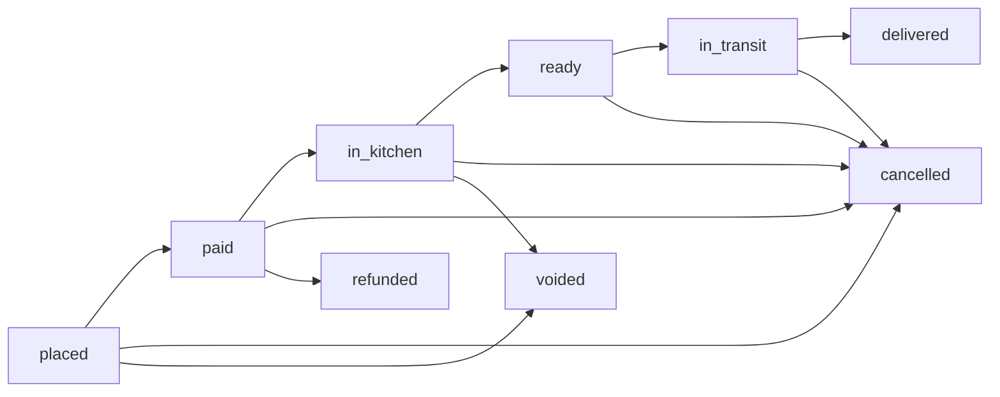

# Actor Flow and Status Lifecycle

## Purpose
- Define one shared status flow across chef, cashier, admin, client, delivery, and guest/phone orders.
- Remove ambiguity between payment state and kitchen state.
- Clarify who can act at each step and what each actor should see.

See also: **[ordering-policy.md](./ordering-policy.md)** (Policy A: ASAP vs scheduled hours, timezone, and how each queue/board scopes `date=today`).

## Canonical States
- `order.status`: `placed`, `paid`, `in_kitchen`, `ready`, `in_transit`, `delivered`, `cancelled`, `voided`, `refunded`
- `payment.status`: `pending`, `completed`, `failed`, `refunded`

## Core Principle
- `order.status` tracks operations.
- `payment.status` tracks money.
- They are related, but not the same thing.
- Kitchen release must be governed by an explicit policy (`kitchenEligible`) rather than hard-coding `status=paid`.
- Admin/Cashier boards must keep these as two separate projections:
  - **Order Flow Board** groups by `order.status`
  - **Payment Flow Board** groups by `payment.status`

## Architecture Findings (Current Implementation)
- API transition gate allows `placed -> in_kitchen` only when release policy permits (`kitchenEligible` reason must exist).
- KDS queue consumes `kitchenEligible` from API and includes `placed` where policy-approved.
- KDS realtime updates tickets; periodic API refetch re-applies `date=today` (see ordering-policy.md).
- Cash collection can complete payment after prep/transit in COD/postpay paths.
- Scheduled intent exists (`estimatedReadyTime`) but there is no first-class release-window state in API.

### Key artifact references
- Contracts: `libs/contracts/src/order.schema.ts`, `libs/contracts/src/order.api.contracts.ts`
- API transitions and queue: `services/api/src/app/order/order.service.ts`
- API role guards: `services/api/src/app/order/order.controller.ts`
- KDS fetch/realtime/actions: `apps/kitchen/src/app/page.tsx`, `apps/kitchen/src/components/OrderCard.tsx`
- Delivery assign/collect flow: `apps/delivery/src/store/useDeliveryStore.ts`
- Cashier support/cash collection operations: `apps/cashier/src/app/page.tsx`

## Global Lifecycle

## Actor-by-Actor Flow

### Cashier
- Creates order (`placed` or `paid` depending on channel/payment evidence).
- **Counter POS payment timing:** Cashiers choose **Pay now** (`paymentCollection: immediate` → payment completed at submit) or **Pay later** (deferred: `on_pickup` / `on_delivery` / `at_collection` by fulfillment; kitchen may proceed while `paymentStatus` stays `pending`). **Pay later** does not ask cash vs card at placement — the payload uses a **cash placeholder** for policy; **`mark-payment-received`** records the actual **cash or card** at collection. **Phone orders** stay deferred by fulfillment (pickup vs delivery), not the counter toggle.
- **Collection is mandatory for handoff:** `ready -> delivered` requires `paymentStatus: completed`. Queue cards prompt **Collect cash/card** before **Mark collected**; cancelling must not be the only obvious action on unpaid ready tickets.
- Payload field `paymentCollection` is stored end-to-end (including offline sync); API `derivePaymentCollection` recognizes `ON_*` / `AT_COLLECTION_*` transaction-id prefixes for queue labels (`formatPaymentCollectionDisplayLabel` maps takeaway pay-later to “Pay at handoff”).
- Handles support edits (phone/name/address/time corrections).
- Handles payment reconciliation (`mark-payment-received`) when cash/card is collected.
- Sees broad queue (`placed` through `delivered`) with operational and support slices.

### Chef (KDS)
- Primary work queue is `paid` and `in_kitchen`.
- Actions:
  - `paid -> in_kitchen` (start prep; UI label should be "Start prep" or "Accept ticket")
  - `in_kitchen -> ready` (cooked and ready)
- Does not own payment settlement.

### Delivery
- Pulls from `ready` delivery orders.
- Actions:
  - assign/self-assign `ready -> in_transit`
  - complete delivery `in_transit -> delivered`
  - collect on-drop payment via `mark-payment-received` with `method=cash|card`
  - open destination in external map app (Google Maps search deep-link from delivery address)

### Admin
- Full visibility and override authority.
- Can handle governance actions (`voided`, `refunded`) where policy allows.
- Monitors mismatches between status and payment state.

### Client (Authenticated)
- Sees trackable progression and payment state.
- Should reflect non-happy paths when they occur (`cancelled`, `refunded`).
- Does not directly mutate operational status.

### Guest / Phone Order
- Typically created by cashier path.
- May start with `payment.status=pending`.
- Requires explicit policy whether kitchen release is allowed before payment completion.

## Release Rules (Kitchen Eligibility)
- `paid` is always kitchen-eligible.
- Pending-payment exceptions are allowed when explicitly policy-approved:
  - dine-in postpay,
  - delivery COD,
  - phone/guest pay-later.
- Scheduled orders are kitchen-eligible only inside release window.
- Admin/cashier manual override can release `placed` tickets with audit reason.
- New order intake should be blocked near close using business cutoff policy (default 60 minutes before service-window close).

## kitchenEligible Policy (System-Architect Version)

### Predicate
- `kitchenEligible(order, now) =`
  - `false` if `order.status` is terminal (`delivered|cancelled|voided|refunded`)
  - `false` if scheduled and `now < releaseAt`
  - `true` if `order.status` in `paid|in_kitchen`
  - `true` if `order.status=placed` and `allowUnpaidRelease(order)=true`
  - otherwise `false`

### `allowUnpaidRelease(order)` rule
- `true` when at least one is satisfied:
  - `fulfillment=dine_in` and postpay policy enabled
  - `fulfillment=delivery` and `payment.method=cash` (COD policy enabled)
  - `source=phone/guest` and pay-later policy enabled
  - explicit manual override recorded by cashier/admin
- `false` for all other pending-payment cases

## Decision Matrix (Truth Table)

### Ready for kitchen (should appear in KDS queue)
- `status=paid` and any payment method: yes
- `status=placed`, dine-in postpay enabled: yes
- `status=placed`, delivery COD enabled: yes
- `status=placed`, phone/guest pay-later enabled: yes
- `status=placed`, no qualifying policy: no
- scheduled order outside release window: no

### Not ready for kitchen
- terminal statuses: no
- `status=placed` with online/card pending and no override: no
- payment failed with no manual override: no

### Requires risk label in KDS
- any `kitchenEligible` ticket with `payment.status != completed`:
  - label as `UNPAID_RISK`
  - show reason: `DINE_IN_POSTPAY`, `DELIVERY_COD`, `PHONE_PAY_LATER`, or `MANUAL_OVERRIDE`

## Recommended UI Language
- Replace "Move to kitchen" with "Start prep" in KDS.
- Keep status labels as backend canonical values for auditability, but use actor-friendly action text.

## Invariants
- `status=paid` must not occur unless payment evidence exists (`payment.status=completed`) except approved offline exception flow.
- `status=refunded` must force `payment.status=refunded`.
- Terminal states (`delivered`, `cancelled`, `voided`, `refunded`) should not transition onward.
- Every unpaid kitchen release must emit an auditable event with actor + reason.
- If `status in (in_kitchen, ready, in_transit)` and `payment.status != completed`, the order must satisfy one approved unpaid-release reason.
- Payment collection at doorstep is auditable with explicit method (`cash_collected` or `card_collected` payment event).
- Status moves must be role-gated server-side (UI/Kanban is never trusted as the authority).

## Role Gate Matrix (Status Moves)
- `paid`: `ADMIN`, `CASHIER`
- `in_kitchen`, `ready`: `KITCHEN`, `ADMIN`
- `in_transit`, `delivered`: `COURIER`, `ADMIN`
- `cancelled`: `ADMIN`, `CASHIER`
- `voided`, `refunded`: `ADMIN` only

## Kanban Permission Contract
- Admin/Cashier/Kitchen/Delivery Kanban boards must consume server-provided actionability from queue payload, not infer moves from local status checks.
- For Admin and Cashier, queue fetch should request full order-flow scope: `placed,paid,in_kitchen,ready,in_transit,delivered,cancelled,voided,refunded`.
- `QueueOrder` permission metadata fields:
  - `allowedNextStatuses`
  - `actions` (`canMove`, `canAssignCourier`, `canCollectPayment`, `canMarkDelivered`, `canVoid`, `canRefund`)
  - `blockedReasonsByStatus` (`ROLE_FORBIDDEN`, `PAYMENT_NOT_COMPLETED`, `COURIER_NOT_ASSIGNED`, etc.)
- UI responsibilities:
  - enable only allowed actions
  - show blocked reason helper text for disabled moves
  - treat API rejections as authoritative if policy changed after initial render
  - in Order Flow projection, split `delivered` into two operational views:
    - `Delivered settled` (`order.status=delivered` and `payment.status=completed`)
    - `Delivered unpaid follow-up` (`order.status=delivered` and `payment.status!=completed`)

## High-Risk Scenarios to Validate
- Scheduled order enters prep only when release window opens.
- Delivery COD: `payment.status` may remain pending through prep/transit and complete on collection.
- Dine-in postpay and phone-pay-later are policy-governed and explicit.
- Role checks are consistent across API/controller/UI actions.
- Realtime drift: KDS/delivery must reconcile API truth when websocket updates are partial.
- Override abuse: manual release volume and value thresholds should alert admin.
- Operational day window must use business opening/closing hours (including overnight shifts), not strict midnight boundaries.

## Contract + Artifact Alignment (Implemented)
- Queue payload already includes release metadata:
  - `kitchenEligible: boolean`
  - `releaseReason: PREPAID|DINE_IN_POSTPAY|DELIVERY_COD|PHONE_PAY_LATER|MANUAL_OVERRIDE`
  - `paymentRisk: LOW|MEDIUM|HIGH`
- Queue payload already includes permission metadata:
  - `allowedNextStatuses`
  - `actions`
  - `blockedReasonsByStatus`
- API remains the source of truth for release eligibility and move authorization.
- `estimatedReadyTime` is customer-facing promise time; release-window-first fields remain a future enhancement.

## Current UX Note
- KDS currently displays `paid` and `in_kitchen`.
- `paid` means prepaid and ready-to-start; it is not the only possible kitchen-eligible state in production policy.
- `in_kitchen` means chef has started active prep.
- Delivery supports explicit cash/card collection actions when payment is still pending.
