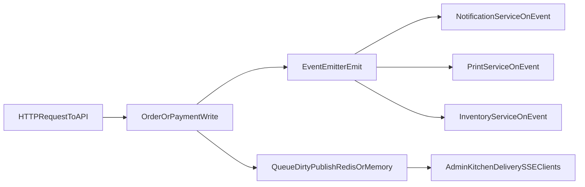

# Concurrency: Current Implementation (Baseline)

This document explains how async/concurrency behavior works today in Wrap & Roll before BullMQ workers are introduced.

## Scope

- API runtime: NestJS in `services/api`
- Current async mechanism: in-process `EventEmitter2`
- Existing Redis usage: queue read-model cache + SSE invalidation (not job processing)

## Current Architecture

## Where Async Events Are Produced

- `services/api/src/app/order/order.service.ts`
  - Emits order lifecycle events such as `order.paid`, `order.in_kitchen`, `order.ready`, `order.in_transit`.
- `services/api/src/app/payment/payment.service.ts`
  - Emits `order.paid` when webhook/reconciliation confirms payment.
- `services/api/src/app/inventory/inventory.service.ts`
  - Emits `inventory.low_stock` when thresholds are crossed.

## Where Async Events Are Consumed

- `services/api/src/app/notification/notification.service.ts`
  - `@OnEvent('order.paid')`, `@OnEvent('order.ready')`, `@OnEvent('order.in_transit')`
  - Sends SMS and writes `notificationDelivery` rows.
- `services/api/src/app/print/print.service.ts`
  - `@OnEvent('order.paid')`, `@OnEvent('order.in_kitchen')`, `@OnEvent('order.ready')`
  - Generates in-memory base64 ESC/POS payloads.
- `services/api/src/app/inventory/inventory.service.ts`
  - `@OnEvent('order.in_kitchen')`, `@OnEvent('order.voided')`, `@OnEvent('order.refunded')`
  - Performs stock consume/reversal transactions.
- `services/api/src/app/order/order.service.ts`
  - `@OnEvent('order.paid')` orchestrates status transition and follow-up activity.

## Important Distinction: Operational Queue vs Job Queue

You already have a production operational queue view:

- `GET /orders/queue` read model
- `GET /orders/queue/stream` SSE dirty stream
- Redis key/channel in `queue-response-cache.service.ts`

This is a UI queue for staff operations, not a durable job-processing queue.

## Reliability Characteristics Today

### What is strong already

- Webhook idempotency claim pattern in `payment.service.ts` using deterministic event IDs.
- Multiple duplicate guards in order and inventory flows.
- Failure logs written into ops activity and notification tables.
- Redis-backed queue dirty invalidation for near-real-time board refresh.

### What is limited today

- Event handling is tied to API process lifetime (in-memory event bus).
- No first-class retry scheduler/backoff per handler.
- No dead-letter queue for failed async side effects.
- API and async side effects are not isolated for independent scaling.

## Current Flow Examples

## `order.paid` (current)

1. Payment webhook succeeds in `payment.service.ts`.
2. Service emits `order.paid`.
3. In-process listeners react (order/status orchestration, print, notification).
4. Failures are logged, but retries are mostly manual/best-effort.

## `order.in_kitchen` (current)

1. Status transition emits `order.in_kitchen`.
2. Inventory consume and print ticket handlers run.
3. Inventory path has internal duplicate checks, but still runs from same event bus.

## Why This Baseline Matters

This current model is clean and fast for early growth, and it already has good domain logic and guardrails.  
The next upgrade is about durability and operability under failure, not replacing your business logic.

## Related Docs

- [queue-realtime.md](./queue-realtime.md)
- [scaling-api-queue.md](./scaling-api-queue.md)
