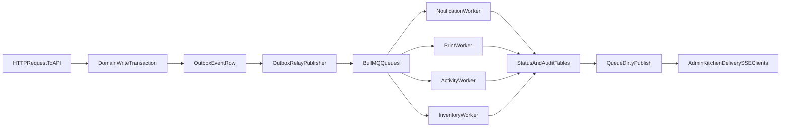

# Concurrency: Improved Design (BullMQ Now, Kafka Ready Later)

This document describes the target concurrency model for Wrap & Roll: durable background processing with BullMQ, plus design boundaries that keep future Kafka adoption straightforward.

## Goals

- Make async side effects durable (no silent loss on process crash).
- Add retries/backoff/dead-letter handling per module.
- Keep request latency low by moving side effects out of API request path.
- Preserve existing operational order queue + SSE behavior.
- Keep event contracts transport-neutral so Kafka can be added later.

## Target Architecture

## What Changes vs Current

- Keep domain logic in existing services (`order`, `payment`, `inventory`, `notification`, `print`).
- Add outbox persistence inside the same transaction as domain state change.
- Relay publishes outbox events to BullMQ with idempotency keys.
- Workers process jobs with retry policy and dead-letter behavior.
- Existing order queue read model and SSE invalidation remain intact.

## Implemented Foundation (Current Progress)

The following are already wired in codebase:

- BullMQ infrastructure module and queue registrations under `services/api/src/app/queue`.
- Worker bootstrap/runtime under `services/api/src/worker.main.ts` and `services/api/src/app/worker.module.ts`.
- Outbox schema + migration:
  - Prisma model `OutboxEvent`
  - migration `services/api/prisma/migrations/20260415130000_outbox_event/migration.sql`
- Outbox service + relay in `services/api/src/app/outbox`.
- Initial outbox writes added in key order/payment paths.
- Notification worker migration implemented:
  - BullMQ processor in `services/api/src/app/notification/notification.processor.ts`
  - Outbox-driven notification jobs for `paid`, `ready`, `in_transit`
- Print worker migration implemented:
  - BullMQ processor in `services/api/src/app/print/print.processor.ts`
  - Outbox-driven print jobs for cashier receipt, kitchen ticket, and ready note
- Activity worker foundation implemented:
  - BullMQ processor in `services/api/src/app/activity/activity.processor.ts`
  - Queue processor writes `activity.queue_processed` audit events
- Inventory worker migration implemented:
  - BullMQ processor in `services/api/src/app/inventory/inventory.processor.ts`
  - Outbox-driven inventory jobs for kitchen consume and reversal (`voided`/`refunded`)
- Payment orchestration migration implemented:
  - BullMQ processor in `services/api/src/app/payment/payment.processor.ts`
  - Outbox-driven payment jobs for webhook/reconcile paid flow and failed signals
- Worker runtime boundaries tightened:
  - Processors are registered via `services/api/src/app/worker-processors.module.ts`
  - API runtime no longer consumes BullMQ jobs; dedicated worker runtime handles queue processing
- Centralized async contracts live in `libs/contracts/src/async.contracts.ts`:
  - queue names, outbox statuses/envelope, notification/print/activity/inventory/payment job contracts

Run commands:

- `npm run start:api:dev`
- `npm run start:worker:dev`

Infra health endpoint:

- `GET /api/queue/infra/health` (admin role)
- Bull Board UI: `GET /api/queues` (admin bearer token required)

Key env flags:

- `BULLMQ_ENABLED` (default auto-enabled when `REDIS_URL` exists)
- `OUTBOX_RELAY_ENABLED` (default true in worker when BullMQ is enabled)
- `OUTBOX_RELAY_POLL_MS`, `OUTBOX_RELAY_BATCH_SIZE`, `OUTBOX_RELAY_DEAD_LETTER_ATTEMPTS`
- `BULL_BOARD_ENABLED` (default on in non-production, off in production)

## Module Mapping (Practical Starting Point)

## 1) Notification Module

- New queue: `notifications.sms`
- Job examples: `notify.order_paid`, `notify.order_ready`, `notify.order_in_transit`
- Retry: exponential backoff, bounded attempts
- DLQ: `notifications.sms.dlq`

## 2) Ticketing/Print Module

- New queue: `print.receipts`
- Job examples: `print.cashier_receipt`, `print.kitchen_ticket`
- Retry: short retry window with payload validation
- DLQ: `print.receipts.dlq`

## 3) Activity Module

- New queue: `activity.events`
- Job examples: `activity.order_status_changed`, `activity.payment_confirmed`
- Use queue for enrichment/fanout while keeping critical audit writes transactional when required.

## 4) Inventory and Payment Orchestration

- Queue: `inventory.movements` (implemented)
  - Jobs: `inventory.order_in_kitchen`, `inventory.order_reversal`
  - Strict idempotency guards remain in `InventoryService` (`hasConsumedCogsForOrder`, `hasReversedCogsForOrder`)
- Queue: `payments.orchestration` (implemented)
  - Jobs: `payment.webhook.paid`, `payment.webhook.failed`, `payment.reconcile.paid`
  - Preserve existing payment idempotency guard behavior (`claimWebhookProcessing`) during migration.

## Reliability Model

## Idempotency

- Store deterministic idempotency keys per job.
- Suggested key shape: `eventType:entityId:eventVersion`.
- Enforce dedupe at enqueue and at worker side effects where needed.

## Retries and Backoff

- Per-queue retry settings (not one-size-fits-all).
- Exponential backoff with max delay caps.
- Timeout + fail-fast for external provider calls.

## Dead Letter Strategy

- Failed jobs move to queue-specific DLQ after max attempts.
- Provide replay procedure with operator guardrails.
- Capture failure metadata: error, attempt, correlationId, payload hash.

## Observability

- Structured logs for enqueue, start, success, failure.
- Track queue lag, active jobs, failed jobs, DLQ size.
- Correlate request -> outbox row -> jobId -> worker logs.

## BullMQ and Existing Operational Queue

Do not replace `GET /orders/queue` and `GET /orders/queue/stream`.  
Those endpoints remain the operational read model for staff apps.

BullMQ workers become the reliable execution layer behind state changes, and workers publish dirty notifications to keep boards fresh.

## Kafka-Ready Boundaries

Design now so transport can change later:

- Canonical event envelope:
  - `eventType`
  - `eventVersion`
  - `entityType`
  - `entityId`
  - `occurredAt`
  - `correlationId`
  - `idempotencyKey`
  - `payloadJson`
- Publisher abstraction:
  - `BullEventPublisher` (now)
  - `KafkaEventPublisher` (future)
- Worker/processor business logic consumes canonical payloads, not Bull-specific internals.

## When Kafka Becomes Worth It

Consider Kafka only when one or more become true:

- Multiple independent consumer teams/services need same event stream.
- Replay/history requirements exceed queue replay patterns.
- Throughput and retention demands become stream-platform scale.
- Real-time analytics/stream processing become first-class requirements.

Until then, BullMQ gives the best complexity-to-value ratio for this repository.

## Rollout Sequence

1. Queue foundation + worker runtime.
2. Outbox model + relay.
3. Notification worker migration.
4. Print worker migration.
5. Activity worker migration.
6. Cleanup and harden worker-only processing.

## Learning Path for Future You

Read in this order:

1. `concurrency-current-implementation.md`
2. This document
3. `queue-realtime.md`
4. `scaling-api-queue.md`

Then compare one real flow (for example `order.paid`) across current and improved models.
