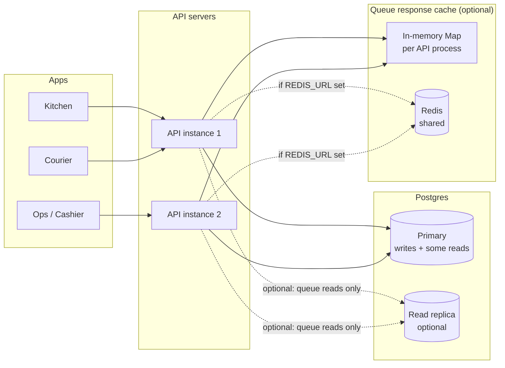
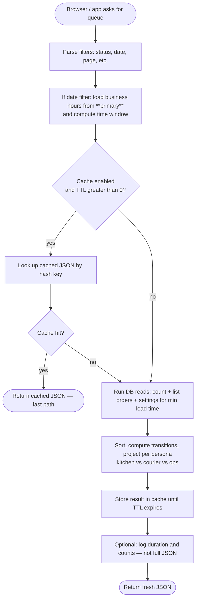
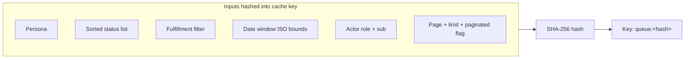
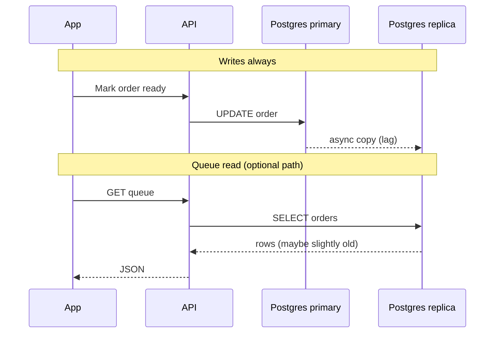
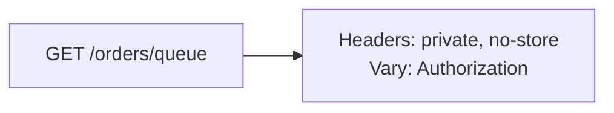
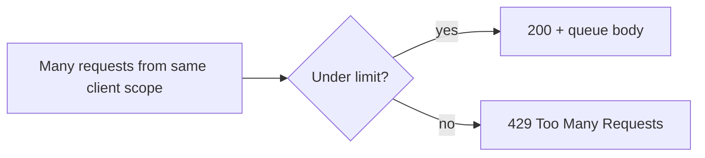

# Order queue scaling — visual guide

This page explains **what we built** for `GET /orders/queue` in normal language. The [checklist-style doc](./scaling-api-queue.md) lists features; this one is for **understanding the “why” and the flow**.

---

## The problem in one sentence

Kitchen and courier apps **poll the queue** often. That means many identical-ish reads hitting Postgres. We made those reads **cheaper**, **safer under load**, and **optional to scale out** (replica + short cache) without changing how orders are **written**.

---

## Big picture: two databases (optional) + one cache (optional)

**Takeaway:**  
- **Primary** = source of truth; **updates** (status changes, payments) always go here.  
- **Replica** = optional extra copy for **read-only** queue queries so the primary breathes.  
- **Cache** = optional **tiny** memory of “what we already computed for this exact request shape,” so we do not hit the DB every millisecond.

---

## What happens on one `GET /orders/queue` request

**Takeaway:**  
- **Date windows** use **primary** settings (opening hours, etc.) so “what counts as today” is consistent.  
- **Order rows** for the list can come from **replica** if you configured it.  
- **Cache** sits *after* we know the filters; it stores the **final** JSON the UI would get.

---

## Why the cache key is “fussy” (persona, role, pagination)

The queue response is **not the same** for everyone:

| Who asks | What differs |
|----------|----------------|
| Kitchen | Smaller payload; different fields |
| Courier | Delivery-focused view |
| Ops / cashier | Full detail, actions |

So we **cannot** cache “the queue” as one blob for all users. The key includes things like **persona**, **status filters**, **date window**, **who is logged in** (role + user id for transition rules), and **page/limit**.

**Takeaway:** Two staff members with different roles never accidentally see each other’s cached queue.

---

## Read replica vs primary (mental model)

Think of **replication lag** as “the copy is a fraction of a second behind.”

**Why it is acceptable:** A kitchen screen showing “in kitchen” a moment after an update is normal; if something must be **strongly consistent**, that path still uses the **primary** (and anything that **writes** does).

---

## HTTP layer (not the same as “cache”)

Browsers must not treat the queue as **public static** data — it is **private** and depends on **who is logged in**.

**Takeaway:** This stops intermediaries from caching your JWT-scoped JSON. The **Redis / memory cache** we added is **server-side** and under our control.

---

## Throttling (abuse / accident protection)

Queue polling gets a **higher** allowed rate than generic routes so normal UIs work, but runaway loops cannot hammer the DB forever.

---

## Environment variables (cheat sheet)

| Variable | Plain English |
|----------|----------------|
| `DATABASE_URL` | Main database; **all writes** and many reads. |
| `DATABASE_READ_URL` | Optional second connection for **queue reads** only. |
| `PRISMA_READ_POOL_MAX` | How many connections the read pool may use (default 10). |
| `REDIS_URL` | If set, queue response cache is **shared** across API instances. |
| `QUEUE_CACHE_TTL_MS` | How long to remember a response (ms). **0** = cache off. |
| `QUEUE_CACHE_ENABLED` | Set `false` to turn cache off even if TTL is set. |
| `QUEUE_PERF_LOG` | `true` / `1` = one log line per queue request with timing and counts. |

---

## What we did **not** change

- **Business rules** for who can move an order — same as before.  
- **Where writes go** — always primary.  
- **Contract types** in `@wrap-roll/contracts` — same shapes; we optimized **how** we fill them.

---

## Where to look in code (if you ever need it)

| Topic | Location |
|-------|----------|
| Queue handler + cache + replica choice | `services/api/src/app/order/order.service.ts` (`getQueue`, `projectQueuePage`) |
| Lean selects per persona | `services/api/src/app/order/order-queue-find.ts` |
| Redis vs memory cache | `services/api/src/app/order/queue-response-cache.service.ts` |
| Optional read Prisma client | `services/api/src/app/prisma/prisma-read.service.ts` |
| HTTP cache headers on route | `services/api/src/app/order/private-no-store-vary-auth.interceptor.ts` |

---

## Related

- [Scaling checklist (features list)](./scaling-api-queue.md)  
- [API env example](../../services/api/.env.example)
